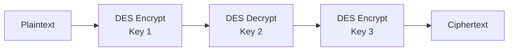
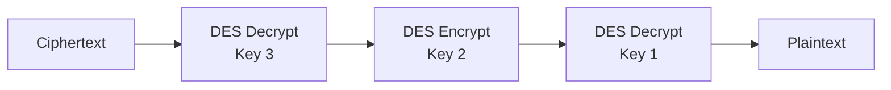

# 3DES 168-bit Hardware IP Core


## Overview

This repository contains a Verilog HDL implementation of a **168-bit Triple DES (3DES) encryption and decryption hardware IP core**.

The design processes 64-bit data blocks using three independent 56-bit DES keys. It supports both 3DES encryption and decryption:

- **Encryption:** `Encrypt(K1) -> Decrypt(K2) -> Encrypt(K3)`
- **Decryption:** `Decrypt(K3) -> Encrypt(K2) -> Decrypt(K1)`

The project was developed for the course **Digital System Design with HDL** at the **Faculty of Computer Engineering, University of Information Technology - VNUHCM**.

## Main Features

- 168-bit Triple DES hardware implementation
- Verilog HDL RTL design
- Supports both encryption and decryption
- Uses three independent DES keys
- Processes 64-bit data blocks
- Includes three hardware architectures:
  - Base architecture
  - Multi-cycle architecture
  - DeepPipe architecture
- Includes automatic Verilog testbenches
- Verified by RTL simulation and post-synthesis simulation
- Synthesized and evaluated using Quartus on Cyclone II FPGA

## Triple DES Operation

### Encryption Mode

```text
Plaintext -> DES Encrypt K1 -> DES Decrypt K2 -> DES Encrypt K3 -> Ciphertext
```

Formula:

```text
C = E(K3, D(K2, E(K1, P)))
```

### Decryption Mode

```text
Ciphertext -> DES Decrypt K3 -> DES Encrypt K2 -> DES Decrypt K1 -> Plaintext
```

Formula:

```text
P = D(K1, E(K2, D(K3, C)))
```

Where:

| Symbol | Description |
|---|---|
| `P` | 64-bit plaintext |
| `C` | 64-bit ciphertext |
| `K1` | First 56-bit DES key |
| `K2` | Second 56-bit DES key |
| `K3` | Third 56-bit DES key |

The total key length is:

```text
56 bits x 3 = 168 bits
```

## DES Core Structure

Each DES operation is based on a 16-round Feistel network.

A DES round follows:

```text
L(i) = R(i-1)
R(i) = L(i-1) XOR F(R(i-1), K(i))
```

The Feistel function `F` consists of:

1. **Expansion:** expands 32-bit data to 48-bit data
2. **XOR with subkey:** combines expanded data with a 48-bit round key
3. **S-box substitution:** maps eight 6-bit groups to eight 4-bit groups
4. **P-box permutation:** rearranges the 32-bit S-box output

Because of the Feistel structure, the same datapath can be reused for both encryption and decryption. The difference is only the order of the round keys:

- Encryption: `K1 -> K2 -> ... -> K16`
- Decryption: `K16 -> K15 -> ... -> K1`

## Repository Structure

```text
3DES_168bit_Hardware/
├── DES_core.v
├── DES_core_base.v
├── DES_core_DeepPipe.v
├── Tri_DES.v
├── Tri_DES_base.v
├── Tri_DES_DeepPipe.v
├── tb_DES_core.v
├── tb_DES_core_base.v
├── tb_DES_core_DeepPipe.v
├── tb_Tri_DES.v
├── tb_Tri_DES_base.v
└── tb_Tri_DES_DeepPipe.v
```

## File Description

| File | Description |
|---|---|
| `DES_core.v` | DES core used in the multi-cycle 3DES design |
| `DES_core_base.v` | Base DES core architecture |
| `DES_core_DeepPipe.v` | Deep pipeline DES core architecture |
| `Tri_DES.v` | Top-level 3DES module using the multi-cycle architecture |
| `Tri_DES_base.v` | Top-level 3DES module using the base architecture |
| `Tri_DES_DeepPipe.v` | Top-level 3DES module using the DeepPipe architecture |
| `tb_DES_core.v` | Testbench for the multi-cycle DES core |
| `tb_DES_core_base.v` | Testbench for the base DES core |
| `tb_DES_core_DeepPipe.v` | Testbench for the DeepPipe DES core |
| `tb_Tri_DES.v` | Testbench for the multi-cycle 3DES design |
| `tb_Tri_DES_base.v` | Testbench for the base 3DES design |
| `tb_Tri_DES_DeepPipe.v` | Testbench for the DeepPipe 3DES design |

## Implemented Architectures

### 1. Base Architecture

The Base architecture is the reference design of the project.

Characteristics:

- Sequential DES round processing
- One Feistel round is processed per clock cycle
- Uses simple control logic
- Lowest hardware resource usage
- Suitable as a baseline design for verification and comparison

In the 3DES Base design, three DES operations are executed sequentially to perform the complete EDE or DED flow.

### 2. Multi-cycle Architecture

The Multi-cycle architecture improves timing by splitting one Feistel round into smaller phases.

A Feistel round is divided into three main phases:

```text
Expansion + XOR -> S-box and P-box -> L/R update
```

Characteristics:

- Reduces the critical path of one DES round
- Improves maximum operating frequency compared with the Base design
- Requires more cycles per block because each round is divided into multiple phases
- Provides a balance between resource usage and timing improvement

### 3. DeepPipe Architecture

The DeepPipe architecture is designed to maximize throughput.

Main idea:

- Inherits the round-splitting idea from the Multi-cycle architecture
- Replaces phase-based FSM control with pipeline registers
- Unrolls the 16 Feistel rounds into pipeline stages
- Adds micro-pipeline registers inside each DES round
- Uses `valid_in` and `valid_out` to control data validity
- Allows multiple data blocks to be processed simultaneously in the pipeline

After the pipeline is filled, the design can output one 64-bit block per clock cycle.

## Architecture Diagram

### 3DES EDE Flow



### 3DES DED Flow



### DeepPipe Data Flow


## Operation Mode

| Mode | Operation | 3DES Flow |
|---|---|---|
| `1` | Encryption | `E(K1) -> D(K2) -> E(K3)` |
| `0` | Decryption | `D(K3) -> E(K2) -> D(K1)` |

## Interface Overview

The exact port list may vary between architectures. In general, the designs use the following signals.

### Start/Done Interface

Used by the Base and Multi-cycle architectures.

| Signal | Direction | Width | Description |
|---|---:|---:|---|
| `clk` | Input | 1 | System clock |
| `rst` | Input | 1 | Reset signal |
| `start` | Input | 1 | Starts one encryption/decryption operation |
| `mode` | Input | 1 | Selects encryption or decryption |
| `data_in` | Input | 64 | Plaintext or ciphertext input |
| `key1` | Input | 56 | First DES key |
| `key2` | Input | 56 | Second DES key |
| `key3` | Input | 56 | Third DES key |
| `done` | Output | 1 | Indicates that the output is valid |
| `data_out` | Output | 64 | Ciphertext or plaintext output |

### Valid Interface

Used by the DeepPipe architecture.

| Signal | Direction | Width | Description |
|---|---:|---:|---|
| `clk` | Input | 1 | System clock |
| `rst` | Input | 1 | Reset signal |
| `valid_in` | Input | 1 | Indicates that input data is valid |
| `mode` | Input | 1 | Selects encryption or decryption |
| `data_in` | Input | 64 | Plaintext or ciphertext input |
| `key1` | Input | 56 | First DES key |
| `key2` | Input | 56 | Second DES key |
| `key3` | Input | 56 | Third DES key |
| `valid_out` | Output | 1 | Indicates that output data is valid |
| `data_out` | Output | 64 | Ciphertext or plaintext output |

## Verification

The design was verified using automatic Verilog testbenches.

The verification flow includes:

1. Apply reset
2. Provide input block and keys
3. Select encryption or decryption mode
4. Assert `start` or `valid_in`
5. Wait for `done` or `valid_out`
6. Compare output with the expected value
7. Print `PASS`, `FAIL`, or `TIMEOUT`

The testbenches include timeout mechanisms to prevent simulation from running indefinitely when the DUT does not respond correctly.

## Simulation Results

All three architectures were verified in both:

- RTL simulation / pre-simulation
- Gate-level simulation / post-simulation

The verified top-level modules are:

| Architecture | Testbench | Valid Signal | Result |
|---|---|---|---|
| Base | `tb_Tri_DES_base.v` | `done` | PASS |
| Multi-cycle | `tb_Tri_DES.v` | `done` | PASS |
| DeepPipe | `tb_Tri_DES_DeepPipe.v` | `valid_out` | PASS |

In post-synthesis simulation, a small delay is required after `done` or `valid_out` before sampling the output because the synthesized netlist includes propagation delay.

## Synthesis Target

The designs were synthesized using Quartus for:

```text
FPGA Family : Cyclone II
Device      : EP2C35F672C6
Board       : DE2
```

## Hardware Performance Summary

| Architecture | Logic Cells | Registers | Fmax | Latency / Block | Cycles per Block for Throughput | Throughput |
|---|---:|---:|---:|---:|---:|---:|
| `Tri_DES_base` | 3183 | 402 | 119.13 MHz | 50 cycles | 50 | 152.49 Mbps |
| `Tri_DES` Multi-cycle | 3206 | 651 | 172.27 MHz | 146 cycles | 146 | 75.52 Mbps |
| `Tri_DES_DeepPipe` | 21090 | 13590 | 366.97 MHz | 149 cycles | 1 after pipeline fill | 23486.08 Mbps |

## Result Analysis

### Base

The Base architecture uses the least hardware resources and has the lowest single-block latency among the three architectures. However, its maximum frequency and throughput are limited by the long combinational path inside one Feistel round.

### Multi-cycle

The Multi-cycle architecture improves Fmax by dividing one Feistel round into three shorter phases. However, the number of cycles per block increases, so its throughput is lower than the Base architecture for single-stream block processing.

### DeepPipe

The DeepPipe architecture consumes the most hardware resources because it unrolls the Feistel rounds and inserts many pipeline registers. In return, it achieves the highest Fmax and the highest throughput. This architecture is best suited for applications that process many continuous data blocks.

## How to Run Simulation

### 1. Clone the repository

```bash
git clone https://github.com/NhatHuyUIT/3DES_168bit_Hardware.git
cd 3DES_168bit_Hardware
```

### 2. Compile all Verilog files in ModelSim

```tcl
vlog *.v
```

### 3. Run Base 3DES simulation

```tcl
vsim tb_Tri_DES_base
run -all
```

### 4. Run Multi-cycle 3DES simulation

```tcl
vsim tb_Tri_DES
run -all
```

### 5. Run DeepPipe 3DES simulation

```tcl
vsim tb_Tri_DES_DeepPipe
run -all
```

## Example Test Vector

One verified 3DES block used in simulation:

```text
Plaintext  : 5472756F6E672044
Ciphertext : EF3710901AD7E49B
```

The ciphertext can be decrypted back to the original plaintext using the same three keys and decryption mode.

## Throughput Formula

Throughput is calculated as:

```text
Throughput (Mbps) = 64 x Fmax (MHz) / Cycles_per_block
```

Where:

- `64` is the DES/3DES block size in bits
- `Fmax` is the maximum operating frequency
- `Cycles_per_block` is the number of cycles required to produce one output block

For DeepPipe, after the pipeline is filled:

```text
Cycles_per_block = 1
```

## Design Trade-off

| Requirement | Recommended Architecture |
|---|---|
| Lowest resource usage | Base |
| Better timing with moderate resource cost | Multi-cycle |
| Highest continuous throughput | DeepPipe |
| Simple verification baseline | Base |
| Processing many consecutive blocks | DeepPipe |

## Future Improvements

Possible future work:

- Add AXI4-Stream interface
- Add more block cipher modes such as CBC, CFB, OFB, and CTR
- Add PKCS#7 padding support at system level
- Optimize DeepPipe resource usage
- Add synthesis scripts
- Add waveform images to documentation
- Add more test vectors generated from a reference software model
- Package the design as a reusable FPGA IP core

## Authors

- **Nguyễn Gia Huy** - 23520629
- **Nguyễn Nhật Huy** - 23520636
- **Nguyễn Thanh Huy** - 23520638

## Supervisor

**ThS. Ngô Hiếu Trường**

## Course

**Digital System Design with HDL**  
Faculty of Computer Engineering  
University of Information Technology - VNUHCM

## License

This project is developed for academic and educational purposes.
